# Notes API: DevSecOps CI/CD Pipeline on AWS EKS

A Jenkins pipeline that **scans, tests, builds, and deploys** a small Node.js/Express app to **AWS EKS**, with security gates at every stage. The pipeline is proven by breaking it on purpose: each gate has a red run (attack) and a green run (fix).


<!-- SCREENSHOT: Jenkins Stage View, full green run -->

---

## Table of contents

1. [Architecture](#architecture)
2. [Tech stack](#tech-stack)
3. [Pipeline stages](#pipeline-stages)
4. [Security controls](#security-controls)
5. [Break-and-fix demos](#break-and-fix-demos)
6. [Repository structure](#repository-structure)
7. [How to run](#how-to-run)
8. [Teardown](#teardown)
9. [Lessons learned](#lessons-learned)
10. [Known limitations](#known-limitations)
11. [Future work](#future-work)

---

## Architecture


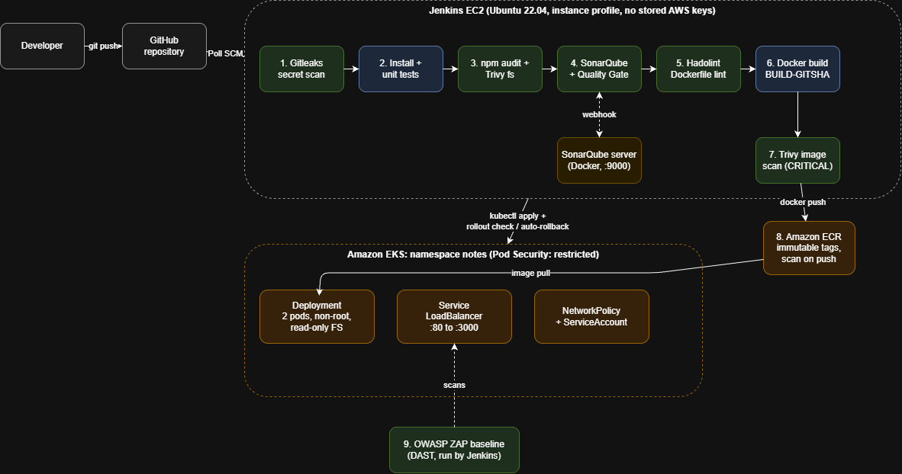
<!-- SCREENSHOT (optional): a polished diagram exported from draw.io, if you prefer it over the Mermaid above -->

**Flow in one sentence:** a push to GitHub triggers Jenkins, which runs security and quality gates, builds and scans a container image, pushes it to ECR, deploys it to EKS with automatic rollback, and finally runs a dynamic scan against the live app.

---

## Tech stack

| Area | Tool |
|---|---|
| App | Node.js 20, Express, Jest, Supertest |
| CI/CD | Jenkins (declarative pipeline, Pipeline from SCM) |
| Secret scanning | Gitleaks |
| Dependency and image scanning | npm audit, Trivy |
| Code quality and SAST | SonarQube Community Build |
| Dockerfile linting | Hadolint |
| Container registry | Amazon ECR (immutable tags, scan on push) |
| Orchestration | Amazon EKS (managed node group) |
| DAST | OWASP ZAP baseline |
| Infrastructure as code | Terraform |
| Environment | AWS Academy Learner Lab (us-east-1) |

---

## Pipeline stages

| # | Stage | Tool | What it catches | Gates the build? |
|---|---|---|---|---|
| 1 | Checkout | Git | Fetches source, computes short commit hash | n/a |
| 2 | Secret scan | Gitleaks | Hardcoded credentials, including ones in git history | Yes |
| 3 | Install and unit test | npm, Jest | Broken code, produces coverage report | Yes |
| 4 | Dependency scan | npm audit, Trivy fs | Known CVEs in dependencies (HIGH and above) | Yes |
| 5 | SonarQube scan | SonarScanner | Bugs, vulnerabilities, security hotspots, code smells | n/a (feeds gate) |
| 6 | Quality Gate | SonarQube | Fails if the gate conditions are not met | Yes |
| 7 | Dockerfile lint | Hadolint | Bad Dockerfile practices | Yes (warning and above) |
| 8 | Docker build | Docker | Image tagged `BUILD_NUMBER-GITSHA` | Yes |
| 9 | Image scan | Trivy | CVEs and secrets baked into the image | Yes (CRITICAL, fixable) |
| 10 | Push to ECR | AWS CLI | Publishes immutable, scanned image | Yes |
| 11 | Deploy to EKS | kubectl | Applies hardened manifests | Yes |
| 12 | Verify rollout | kubectl | Failed deployments trigger `rollout undo` | Yes |
| 13 | DAST | OWASP ZAP | Missing headers, runtime web issues | No (report only) |
| 14 | Post actions | Jenkins | Archives reports, cleans up images, reports status | n/a |


<!-- SCREENSHOT: Stage View showing all stages with timings -->

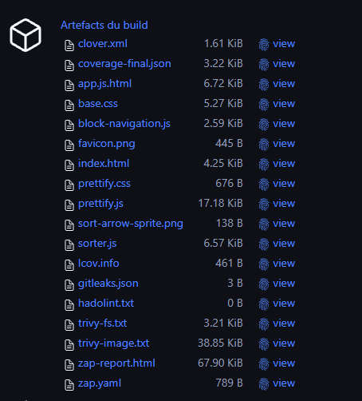
<!-- SCREENSHOT: Build page listing archived artifacts (coverage, gitleaks.json, trivy reports, ZAP report) -->

---

## Security controls

### Pipeline
- **Shift-left scanning:** cheap checks (secrets, dependencies) run before expensive ones (build, deploy).
- **No stored AWS keys:** Jenkins uses the EC2 instance profile, so nothing long-lived is in Jenkins or the repo.
- **Secrets handled by Jenkins credentials:** the SonarQube token and GitHub token are injected at runtime and masked in logs.
- **Redacted reports:** Gitleaks runs with `--redact` so reports never contain the secret.
- **Immutable image tags:** every image is unique and traceable to a build number and commit.

### Container
- Multi-stage build with a pinned base image
- Runs as non-root (`USER 1000`)
- npm removed from the runtime image (removed a CRITICAL CVE bundled with the base image)
- Only production dependencies installed (`npm ci --omit=dev`)
- Health check defined

### Kubernetes
- Dedicated namespace with **Pod Security Standard: `restricted`**
- Dedicated ServiceAccount with token automount disabled
- `runAsNonRoot`, `allowPrivilegeEscalation: false`, `readOnlyRootFilesystem: true`
- All Linux capabilities dropped, `seccompProfile: RuntimeDefault`
- Resource requests and limits; liveness and readiness probes on `/health`
- 2 replicas with a zero-downtime rolling update
- NetworkPolicy restricting ingress and blocking egress (**enforcement status: see [Known limitations](#known-limitations)**)


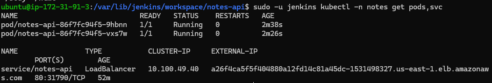
<!-- SCREENSHOT: `kubectl -n notes get pods,svc` -->

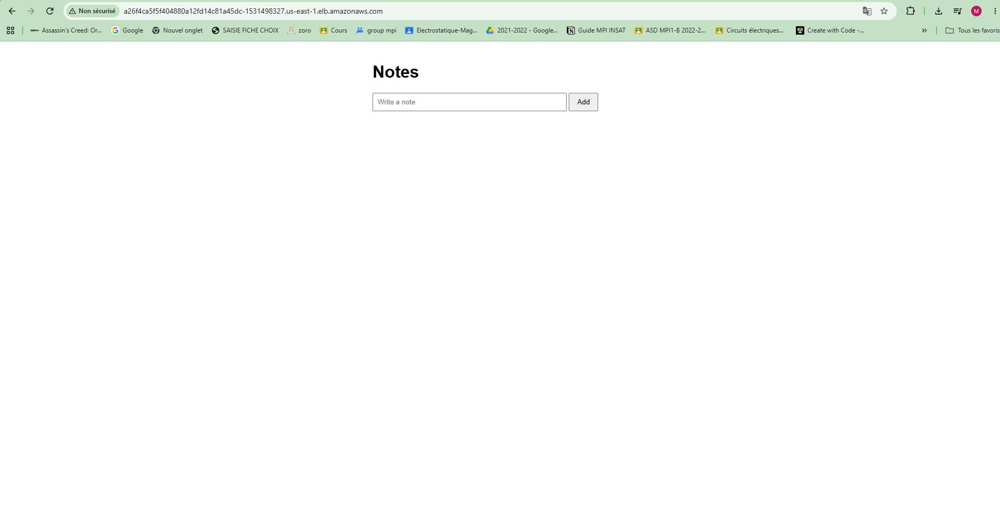
<!-- SCREENSHOT: browser showing the app (crop out the load balancer hostname if you prefer) -->

---

## Break-and-fix demos

Each gate is proven by introducing a realistic mistake on a throwaway branch, watching the pipeline fail, then fixing it.

### 1. Leaked secret (Gitleaks)

A fake AWS-style key was committed to `config.js`. Gitleaks failed the build and identified the file, line, commit, and author, with the secret redacted.

**Key lesson:** deleting the file in a later commit did **not** turn the build green, because the secret remains in git history. In a real incident the order is: revoke the credential, then clean up code and history.

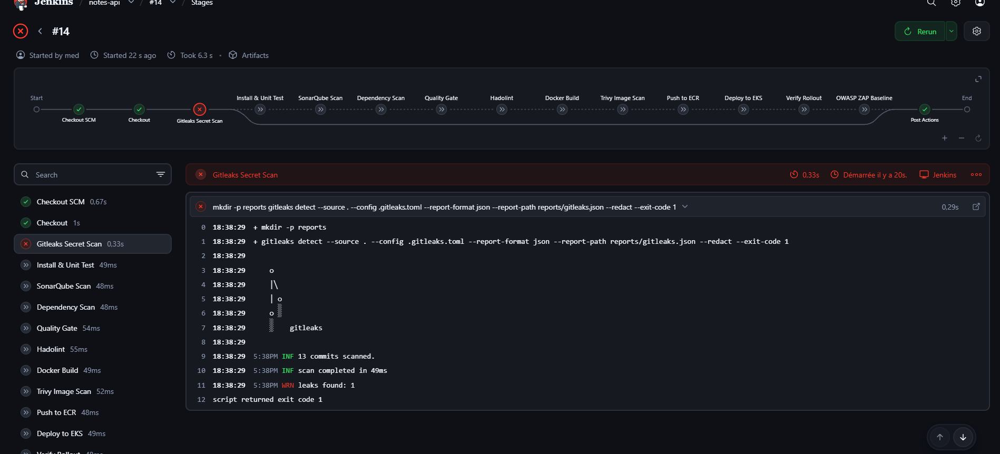
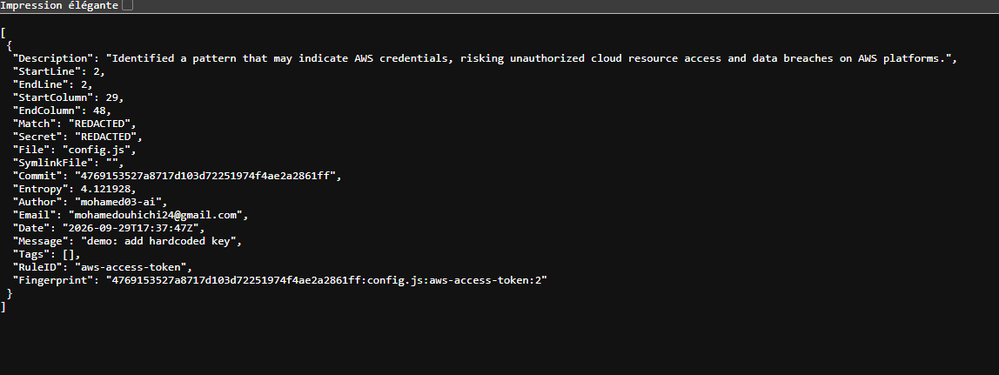

<!-- SCREENSHOTS: red stage view, Gitleaks JSON report, still red after deletion, green run on clean history -->

### 2. Vulnerable dependency (npm audit / Trivy fs)

`lodash@4.17.15` was added. The Dependency Scan stage failed with high-severity advisories. Upgrading the package fixed it.

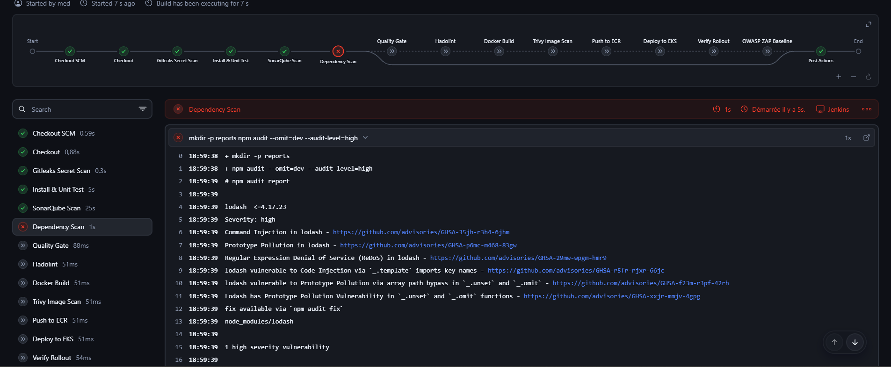

### 3. Insecure code (SonarQube)
 
**Quality Gate configuration.** A custom gate named `notes-gate` is assigned to the project and evaluates **Overall Code**, since SonarQube Community Build has no branch analysis and the default gate only judges "new code". Conditions:
 
| Metric (Overall Code) | Operator | Threshold | Purpose |
|---|---|---|---|
| Security Hotspots Reviewed | is less than | 100% | Fails while any security hotspot is unreviewed |
| Security Rating / Vulnerabilities | is worse than / greater than | A / 0 | Fails when a real vulnerability is detected |
| Coverage *(fallback)* | is less than | slightly below current coverage | Fails when untested code is added |
 
> Metric names vary slightly between SonarQube versions, so the exact conditions used are the ones available in the version running here (26.x). The gate was first verified to **pass on clean `main`**, so that a red result means a real regression and not a gate that fails on everything.
 
**The change:** on a throwaway branch, a note was rendered with `innerHTML` and unsanitized user text (an XSS pattern), and `Math.random()` was used to generate a token (weak randomness, reported as a security hotspot). The scan completed, but the **Quality Gate** stage failed, and the pipeline stopped before building or deploying anything.
 
**What SonarQube reported:** <!-- FILL IN: the failed condition(s) and the hotspot/issue titles shown in SonarQube -->
 
**The fix:** the unsafe rendering was replaced with `textContent`, and `Math.random()` was removed. The gate passed on the next run.
 
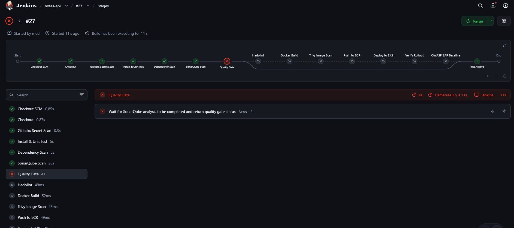
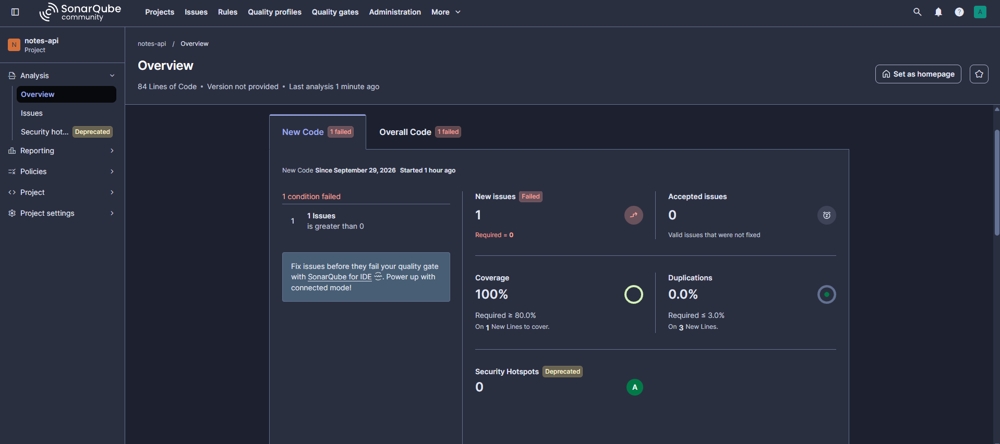
 

## Repository structure

```
.
├── app.js                      # Express app (exported for tests)
├── server.js                   # Starts the server on port 3000
├── package.json
├── package-lock.json
├── public/index.html
├── tests/app.test.js           # Jest + Supertest
├── Dockerfile                  # Multi-stage, non-root, pinned base
├── .dockerignore
├── Jenkinsfile                 # Declarative pipeline
├── sonar-project.properties
├── .gitleaks.toml
├── k8s/
│   ├── namespace.yaml
│   ├── serviceaccount.yaml
│   ├── deployment.yaml
│   ├── service.yaml
│   └── networkpolicy.yaml
├── terraform/                      # Terraform (EKS, Jenkins EC2)
└── screenshots/                # Screenshots used in this READMEs
```

---

## How to run

> Built for **AWS Academy Learner Lab**, where IAM users and roles cannot be created. It uses the pre-made `LabRole` and `LabInstanceProfile`.

### Prerequisites
- AWS Learner Lab session (credentials expire each session)
- Docker, Terraform, AWS CLI, kubectl on your machine
- The `vockey` key pair for SSH

### 1. Run the app locally
```bash
npm ci
npm test
docker build -t notes-api:local .
docker run --rm -p 3000:3000 --read-only --cap-drop ALL \
  --security-opt no-new-privileges notes-api:local
curl http://localhost:3000/health
```

### 2. Provision infrastructure
```bash
cd infra
terraform init
terraform apply
aws eks update-kubeconfig --region us-east-1 --name notes-eks
kubectl get nodes
```

### 3. Set up Jenkins and SonarQube (on the Jenkins EC2)
- Jenkins with Java 21; Node 20, Docker, AWS CLI, kubectl, Trivy, Gitleaks, Hadolint installed
- SonarQube as a Docker container (`vm.max_map_count=524288`, 2 GB swap)
- Jenkins credentials: `sonar-token` (secret text), GitHub token (username with password)
- SonarQube server named `sonarqube`, scanner tool named `sonar-scanner`
- SonarQube webhook to `http://<jenkins-private-ip>:8080/sonarqube-webhook/`

### 4. Create the job
Pipeline from SCM, pointing at this repo and `Jenkinsfile`, with Poll SCM (`H/5 * * * *`).

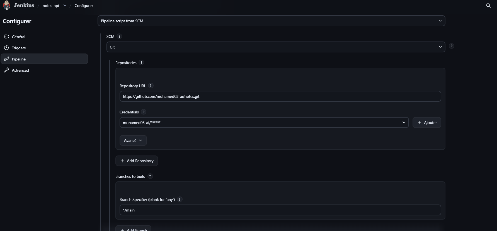
<!-- SCREENSHOT: job configuration (blur any credentials or IPs) -->

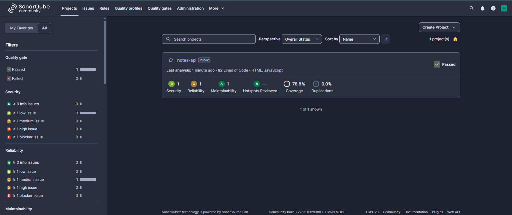
<!-- SCREENSHOT: SonarQube project dashboard with passing Quality Gate -->

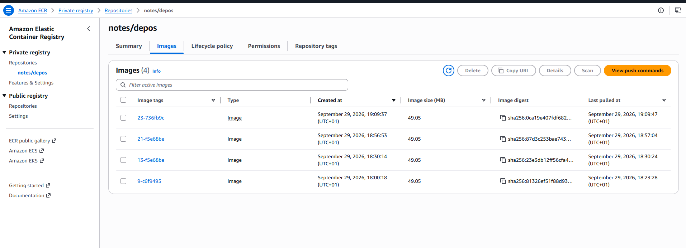
<!-- SCREENSHOT: ECR repository showing tagged images and scan results (crop the account ID) -->

---

## Teardown

The cluster and load balancer bill while they exist. Remove them in this order:

```bash
kubectl delete svc notes-api -n notes    # removes the load balancer first
# wait 1-2 minutes
cd infra && terraform destroy            # EKS cluster and nodes
```

Then stop the Jenkins EC2 instance. Verify in the console that no load balancers, node groups, or NAT gateways remain.

---

## Lessons learned

| Problem | Cause | Fix |
|---|---|---|
| `npm: not found` in Jenkins | Ubuntu's default `nodejs` was v12 without npm | Installed Node 20 from NodeSource |
| Scanner error: missing `sonar.projectKey` | `sonar-project.properties` not in the workspace root | Committed the file to the repo root |
| Trivy CRITICAL on the first image build | Vulnerable `tar` bundled inside npm in the base image | Removed npm from the runtime image |
| Gitleaks still failing after deleting the secret | Secrets stay in git history; scan covered all refs | Reset the history and scoped the scan with `--log-opts="HEAD"` |
| `no objects passed to apply` | Manifest files were empty | Filled and committed the files |
| Jenkins install script partly failed | Wrong Java version (17 instead of 21) | Installed Java 21 manually |

---

## Known limitations

Stated honestly, since this is a lab environment:

- **Public EKS API endpoint**, protected by IAM authentication. Restricting CIDRs would break whenever the Jenkins IP changes.
- **NetworkPolicy enforcement:** <!-- FILL IN: "enforced via VPC CNI network policy add-on" or "defined but not enforced because the add-on is not enabled" -->
- **The `jenkins` user is in the `docker` group**, which is effectively root on the host.
- **HTTP only:** the service is exposed through a plain load balancer with no TLS.
- **SonarQube and Jenkins share one EC2 instance** to save budget.
- **Nodes run in default public subnets.**
- **ZAP baseline is report-only** (`-I`); it does not fail the build.
- **Polling instead of a webhook**, because the Jenkins port is restricted to a single IP.
- **Learner Lab constraints:** no custom IAM roles, expiring credentials, changing public IPs, and limited budget.

---

## Future work

- Enable EKS control plane audit logging
- Add monitoring (metrics-server, Prometheus, Grafana)
- Add TLS with an Ingress and ACM certificate
- Sign images (cosign) and verify at admission
- Generate an SBOM (Syft or Trivy) and store it as a build artifact
- Use a private subnet layout with a bastion or VPN for Jenkins access
- Make ZAP gate on high-severity findings

---

## Author

**Mohamed** · [GitHub](https://github.com/mohamed03-ai) · [LinkedIn](https://www.linkedin.com/in/your-profile)